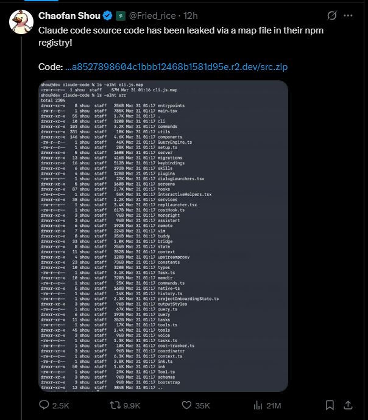

# 🦅 Claude Code: 源代码泄露分析 (2026年3月31日)

> [!IMPORTANT]
> 本仓库详细记录了 Anthropic 意外泄露其 **Claude Code** CLI 工具完整源代码的事件。

---

### 🌐 选择语言 / Select Your Language:
[🇺🇸 English](README.md) | [🇪🇸 Español](README.es.md) | [🇧🇷 Português](README.pt.md) | [🇨🇳 中文](README.zh.md) | [🇫🇷 Français](README.fr.md) | [🇩🇪 Deutsch](README.de.md) | [🇯🇵 日本語](README.ja.md) | [🇷🇺 Русский](README.ru.md)

---

## 🔍 事件概述
**2026年3月31日**，Anthropic 在 npm 仓库发布的 `@anthropic-ai/claude-code` 软件包 **v2.1.88** 版本中，不慎包含了一个 **59.8 MB** 的源映射文件 (`cli.js.map`)。

泄露是由于构建过程中的**打包错误**导致的。源映射旨在将压缩后的生产代码映射回原始源代码以便调试；通过包含此文件，Anthropic 在不知不觉中提供了其整个 CLI 架构的“蓝图”。

### 🛠️ 关键发现与架构见解
对 **1,902 个专有文件**和 **512,000 行 TypeScript** 的分析揭示了：

*   **KAIROS 编排引擎：** Claude Code 的“大脑”。它处理高级智能体行为、工具调用循环以及复杂的逻辑状态管理，此前人们认为这些完全是在服务器端处理的。
*   **隐身模式 (Undercover Mode)：** 为 Anthropic 员工设计的隐身功能。它允许智能体进行 git 贡献（提交/PR），而不会自动标记为 AI 生成，从而有效地掩盖了在开源项目中使用 AI 的行为。
*   **autoDream（自我修复记忆）：** 一个精密的子系统，在用户不活跃期间激活。它压缩过去的对话上下文并“修复”自己的记忆，以在 Token 窗口内保持最大效率。
*   **未发布模型引用：** 代码包含对内部模型的显式调用，如 **"Capybara"** (Claude 4.6) 和 **"Fennec"** (Opus 4.6)，表明这些模型已在进行活跃测试。

---

## 📸 证据与文档
泄露事件最早由安全研究员 **Chaofan Shou (@Fried_rice)** 在 X (Twitter) 上发现。

*@Fried_rice 在 X 上的最初发现，触发了全球社区的分析。*

---

## 📂 目录结构
| 路径 | 描述 |
| :--- | :--- |
| `source/` | 从 v2.1.88 泄露中重建的 TypeScript 源代码。 |
| `assets/` | 事件的视觉证据和截图。 |

---

## 🔗 官方来源与链接
- **主要公告：** [Chaofan Shou 的推文](https://twitter.com/Fried_rice/status/2038894956459290963)
- **技术分析：** [CyberNews: Anthropic Claude Code 源代码泄露详解](https://cybernews.com/security/anthropic-claude-code-source-leak/)
- **详细报告：** [VentureBeat: Claude Code 源代码泄露分析报告](https://venturebeat.com/ai/claude-codes-source-code-appears-to-have-leaked-heres-what-we-know/)

---

## ⚖️ 法律声明
`source/` 目录中的代码是 **Anthropic 的专有知识产权**。本仓库仅用于**历史和教育记录**。未经授权重新分发或商业使用泄露的代码可能违反版权法和 Anthropic 的服务条款。

---
*精心制作，旨在记录 AI 发展史上的重要里程碑。*
